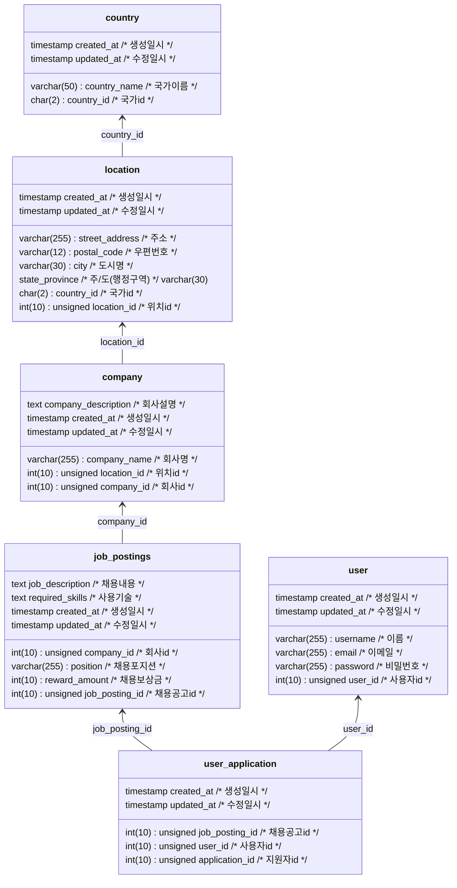

# Wanted Pre-onboarding Backend Internship Assignment

## 1. 개요

**원티드**에서 진행하는 교육형 인턴쉽 과제입니다.[(링크)](https://bow-hair-db3.notion.site/1850bca26fda4e0ca1410df270c03409)

## 2. 요구사항

- 서비스 개요
  - 본 서비스는 기업의 채용을 위한 웹 서비스 입니다.
  - 회사는 채용공고를 생성하고, 이에 사용자는 지원합니다.

- 요구사항
  1. 채용공고 등록
  2. 채용공고 수정
  3. 채용공고 삭제
  4. 채용공고 목록 조회
  5. 채용공고 검색 조회
  6. 채용상세페이지 조회
  7. 사용자가 채용에 지원

- 필수 기술 요건
  1. ORM 사용하여 구현
  2. RDBMS 사용 (SQLite, PostgreSQL,MySql 등)

- 데이터 예시
  1. 채용공고
  ```json
   {
   "회사_id": "회사_id",
   "채용포지션":"백엔드 주니어 개발자",
   "채용보상금":1000000,
   "채용내용":"원티드랩에서 백엔드 주니어 개발자를 채용합니다. 자격요건은..",
   "사용기술":"Python"
   }
   ```
  2. 공고 수정 예시 1
  ```json
  {
  "채용포지션":"백엔드 주니어 개발자",
  "채용보상금":1500000, # 변경됨
  "채용내용":"원티드랩에서 백엔드 주니어 개발자를 '적극' 채용합니다. 자격요건은..", # 변경됨
  "사용기술":"Python"
  }
  ```
  3. 공고 수정 예시 2
  ```json
  {
  "채용포지션":"백엔드 주니어 개발자",
  "채용보상금":1000000,
  "채용내용":"원티드랩에서 백엔드 주니어 개발자를 채용합니다. 자격요건은..",
  "사용기술":"Django" # 변경됨
  }
  ```
  4. 목록 조회 예시
  ```json
  [
  {
  "채용공고_id": 채용공고_id,
  "회사명":"원티드랩",
  "국가":"한국",
  "지역":"서울",
  "채용포지션":"백엔드 주니어 개발자",
  "채용보상금":1500000,
  "사용기술":"Python"
  },
  {
  "채용공고_id": 채용공고_id,
  "회사명":"네이버",
  "국가":"한국",
  "지역":"판교",
  "채용포지션":"Django 백엔드 개발자",
  "채용보상금":1000000,
  "사용기술":"Django"
  },
  ...
  ]
  ```


## 3. 참고

- 위 예시 데이터는 구현의 편의를 위해 제공되는 정보이며, 요구사항(의도)을 만족시킨다면 다른 형태의 요청 및 리스폰스를 사용하여도 좋습니다.

- 필요한 모델: 회사, 사용자, 채용공고, 지원내역(선택사항)
  (이외 추가 모델정의는 자유입니다.)

- 위 제공된 필드명은 예시이며, 임의로 생성 가능합니다.

- 회사, 사용자 등록 절차는 생략합니다.
  (DB에 임의로 생성하여 진행)

- 로그인 등 사용자 인증절차(토큰 등)는 생략합니다.

- Frontend 요소(html, css, js 등)는 개발 범위에 제외됩니다.
  (구현시 불이익은 없지만, 평가에 이점 또한 없습니다.)

- 명시되지 않은 조건또한 자유롭게 개발 가능합니다.

## 4. 구현과정

1. 데이터베이스 설계
